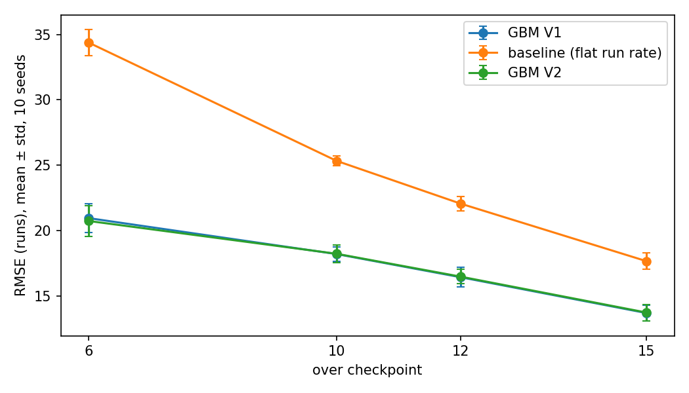
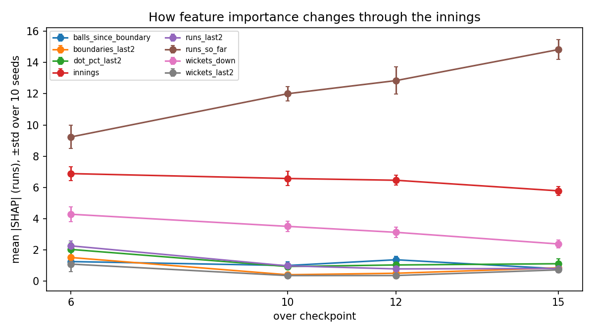
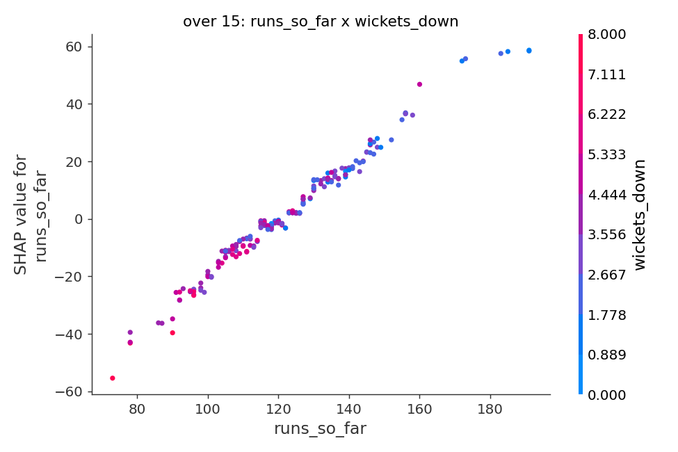
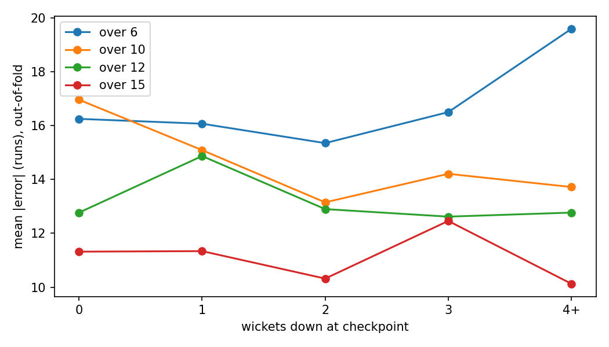
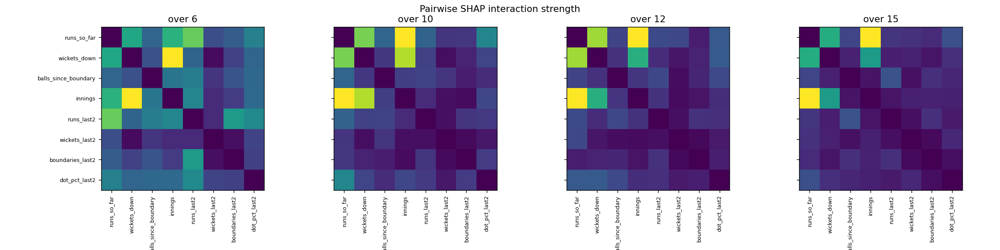

# What the Model Is Looking At: SHAP Explanations of T20 Score Prediction Across Over Checkpoints

**Team B12:** Muskan (lead), Pooja, Kunal, Samarth. Track B, Sequence and Uncertainty.

## Abstract
A projected T20 score is shown with confidence but without explanation. We explain a score-prediction model at four checkpoints (overs 6, 10, 12, 15) using SHAP, compare feature influence across checkpoints, and test how stable the explanations are. Against a flat-run-rate baseline, gradient boosting reduces RMSE at every checkpoint (over 6: 34.4 to 20.7; over 15: 17.7 to 13.7; mean over 10 seeds). The most influential feature is runs_so_far at both over 6 and over 15, and what changes is how much it dominates and what ranks behind it. We report SHAP rank stability across seeds, a permutation-importance cross-check, failure cases, and robustness to less data and corrupted inputs.

## I. Introduction
When a broadcast graphic says 165, "the model said so" is not an explanation. This module supplies the explanation and shows how it changes as the innings progresses. Our handover is `results/feature_importance.csv` (over_mark, feature, importance, direction), consumed by other modules of the unit.

## II. Related Work
**Explanation method.** SHAP assigns each feature a Shapley-value contribution to a prediction [1], with an exact fast algorithm for tree ensembles that also yields pairwise interaction values [2]. Shapley-based importances have known limits: they can disagree with intuitive importance, split credit among correlated inputs and do not imply causation [3], [4]. We therefore cross-check with permutation importance and report seed-to-seed stability.
**Cricket score prediction.** First-innings and per-over score forecasting has been attempted with deep networks on T20 internationals [5], classical model families on IPL data [6], and player-versus-player probability models [7]. These works optimise accuracy; none of them explains what drives the forecast.
**Explainability in cricket.** SHAP has been applied to a winner-prediction model for ODI cricket [9], to IPL first-innings scores using pitch, weather and team data [8], to player metrics [10] and to IPL player performance [11]. These explain static match-level or player-level factors. We did not find work that tracks how feature influence changes between checkpoints inside one innings, which is the gap this module addresses. (Our search was limited to web search in October 2026 and may have missed relevant work.)

## III. Data
The department's SRL league scorecards (JSON, one file per match; 383 completed matches used, 2 excluded: one unfinished, one with a single innings). Ball-by-ball strings were decoded into the shared contract files (matches, deliveries, checkpoints; see data/README.md); decoded runs, wickets and extras reconcile with the scorecard totals for every innings. The modelling table has 3054 rows: one innings at one checkpoint (innings that ended before an over do not have that checkpoint). Mean final score is 175 in the first innings and 159 in the second; the chasing team won 49% of matches. The second-innings final score is censored: a chase stops when the target is passed. Batter, bowler and venue identities are not in the source, so no player-level features are possible. Rows with missing values are dropped and counted (`rows_dropped_missing` in results/model_performance.csv).

## IV. Method
**Features.** V1 uses the four contract predictors plus innings. V2 removes `current_run_rate`, because it equals runs_so_far / over_mark and splits SHAP credit with runs_so_far, and adds four momentum features from deliveries.csv computed over the last two completed overs: runs, wickets, boundaries and dot-ball share.
**Model.** Gradient boosting regressor (150 trees, depth 3, learning rate 0.05, subsample 0.8), one model per checkpoint, retrained per seed.
**Explanation.** `shap.TreeExplainer` on held-out rows. importance = mean |SHAP| (runs); direction = sign of the correlation between feature value and SHAP value (|r| below 0.05 is reported as mixed). Pairwise interactions from SHAP interaction values (3 seeds, 300-row subsample).
**Baseline.** Current run rate held flat to over 20.

## V. Experimental Setup
Ten seeds (0 to 9). Each seed draws a different 75/25 train/test split **grouped by match** so the two innings of a match never straddle the split. Metric: RMSE in runs. We report mean, spread (std), best and worst seed. All runs are logged in `experiments.csv`.

## VI. Results
### A. Prediction against the baseline (RMSE, runs, 10 seeds)
| over | baseline RMSE | GBM V1 (contract features) | GBM V2 (decollinear + momentum) | worst seed (V2) |
|---|---|---|---|---|
| 6 | 34.37 ± 1.02 | 20.96 ± 1.12 | 20.74 ± 1.19 | 22.97 |
| 10 | 25.34 ± 0.38 | 18.22 ± 0.53 | 18.24 ± 0.66 | 19.21 |
| 12 | 22.07 ± 0.55 | 16.45 ± 0.75 | 16.49 ± 0.56 | 17.19 |
| 15 | 17.68 ± 0.62 | 13.71 ± 0.62 | 13.75 ± 0.62 | 14.62 |

Adding momentum features changed RMSE by at most 0.22 runs, well inside the seed spread, so we cannot claim they help.

### B. Feature influence by checkpoint (mean |SHAP|, runs; V2)
| feature | 6 | 10 | 12 | 15 | change 6→15 |
|---|---|---|---|---|---|
| runs_so_far | 9.23 | 12.00 | 12.84 | 14.83 | 5.60 |
| innings | 6.89 | 6.58 | 6.47 | 5.79 | -1.10 |
| wickets_down | 4.29 | 3.51 | 3.13 | 2.39 | -1.90 |
| dot_pct_last2 | 2.04 | 0.94 | 1.04 | 1.12 | -0.92 |
| boundaries_last2 | 1.52 | 0.42 | 0.51 | 0.86 | -0.66 |
| runs_last2 | 2.27 | 0.99 | 0.79 | 0.82 | -1.45 |
| balls_since_boundary | 1.26 | 1.01 | 1.38 | 0.80 | -0.46 |
| wickets_last2 | 1.10 | 0.36 | 0.37 | 0.73 | -0.37 |

Direction of influence at over 15: runs_so_far positive, wickets_down negative, balls_since_boundary negative, innings negative, runs_last2 negative, wickets_last2 positive, boundaries_last2 negative, dot_pct_last2 negative.

### C. Stability of the explanation
Mean Spearman rank correlation of the feature-importance ordering between pairs of seeds: over 6: 0.92 (min 0.71), over 10: 0.94 (min 0.88), over 12: 0.96 (min 0.83), over 15: 0.81 (min 0.52). Agreement between SHAP importance and permutation importance (Spearman, per checkpoint): over 6: 0.95, over 10: 0.74, over 12: 0.93, over 15: 0.90.

### D. Interactions
| over | strongest pair | strength (runs) | strongest pair without innings | strength (runs)   |
|---|---|---|---|---|
| 6 | wickets_down x innings | 1.54 | runs_so_far x runs_last2 | 1.19 |
| 10 | runs_so_far x innings | 1.68 | runs_so_far x wickets_down | 1.33 |
| 12 | runs_so_far x innings | 1.89 | runs_so_far x wickets_down | 1.62 |
| 15 | runs_so_far x innings | 2.19 | runs_so_far x wickets_down | 1.36 |

Reading of the over-15 pairs: this is mostly a data effect: a chase stops when the target is passed, so the same runs at the same over map to a different final score in innings 2 than in innings 1 (censoring), not a pure cricket interaction. Excluding innings, the strongest pair at over 15 is runs_so_far x wickets_down: the same score is worth more with wickets in hand: batters still to come can accelerate, so runs on the board and wickets lost must be read together.

### E. Failure analysis
Largest single out-of-fold error per checkpoint (runs): over 6: 79.0, over 10: 64.5, over 12: 66.3, over 15: 44.2. Mean absolute error by wickets down is in `results/error_by_wickets.csv` and `results/plots/error_by_wickets.png`; the 25 worst cases per checkpoint, with the feature that dominated the explanation, are in `results/failure_cases.csv`. 73% of the 100 worst misses are second innings, typically a chase that ended early (target reached or all out) after the model had forecast a normal score. In these cases the explanation is confident about the cause it can see (typically runs_so_far) while the cause of the miss, the overs yet to be bowled, is not an input at all. 

Three concrete cases (generated from failure_cases.csv; read them against the match yourselves):
- Over 6, match 73284474 innings 2: 48 runs for 1 down; model predicted 163, final score 84 (it over-predicted by 79). The explanation was dominated by innings (-8.6 runs), which says nothing about what the remaining overs would bring.
- Over 12, match 73285248 innings 2: 128 runs for 1 down; model predicted 194, final score 128 (it over-predicted by 66). The explanation was dominated by runs_so_far (+32.2 runs), which says nothing about what the remaining overs would bring.
- Over 15, match 73284502 innings 2: 114 runs for 3 down; model predicted 165, final score 121 (it over-predicted by 44). The explanation was dominated by innings (-5.3 runs), which says nothing about what the remaining overs would bring.

### F. Robustness
GBM RMSE by fraction of training data used (rows: over; columns: fraction):

| over | 0.1 | 0.5 | 1.0 |
|---|---|---|---|
| 6 | 24.54 | 21.38 | 20.73 |
| 10 | 21.37 | 18.75 | 18.21 |
| 12 | 18.81 | 17.28 | 16.46 |
| 15 | 17.23 | 14.36 | 13.75 |

With 3% of test inputs corrupted (runs_so_far x3), RMSE at full training data: over 6: 21.43, over 10: 19.58, over 12: 18.62, over 15: 16.8.

### G. Integration test against B1 (over 6)
On the same 766 over-6 rows, B1's predicted_score has RMSE 21.59 and MAE 16.94; our out-of-fold gradient boosting has RMSE 20.13 and MAE 16.06; the flat run-rate baseline has RMSE 33.45. The paired bootstrap 95% interval (resampling matches) for the RMSE gap (B1 minus ours) is [0.92, 2.04]. B1's stated range covers the true final score 90.7% of the time with mean width 72 runs. Caveats: we do not know B1's features or how it was validated, our features include last-two-over momentum, and a gap of this size could reflect any of these differences rather than a better method.

### H. Setting versus chasing
Separate models per innings (no innings feature, 10 seeds). Mean |SHAP| by innings and checkpoint:

| feature | inn1 over6 | inn1 over10 | inn1 over12 | inn1 over15 | inn2 over6 | inn2 over10 | inn2 over12 | inn2 over15 |
|---|---|---|---|---|---|---|---|---|
| balls_since_boundary | 2.22 | 1.57 | 1.21 | 0.94 | 1.90 | 2.05 | 2.22 | 1.15 |
| boundaries_last2 | 2.23 | 0.79 | 0.91 | 0.40 | 0.73 | 0.54 | 0.50 | 1.42 |
| dot_pct_last2 | 2.37 | 1.48 | 1.53 | 0.67 | 3.15 | 1.44 | 1.67 | 2.26 |
| runs_last2 | 2.64 | 1.49 | 1.48 | 1.32 | 3.20 | 1.96 | 1.18 | 1.81 |
| runs_so_far | 9.96 | 13.32 | 14.09 | 16.48 | 9.20 | 11.29 | 12.54 | 13.55 |
| wickets_down | 6.60 | 5.91 | 4.68 | 4.05 | 1.82 | 1.68 | 2.43 | 2.11 |
| wickets_last2 | 1.49 | 0.44 | 0.59 | 0.51 | 1.11 | 0.52 | 0.57 | 0.89 |

RMSE by innings:

| innings | over_mark | GBM RMSE | baseline RMSE |
|---|---|---|---|
| 1 | 6 | 19.3 ± 1.5 | 34.80 |
| 1 | 10 | 16.7 ± 0.7 | 26.50 |
| 1 | 12 | 13.6 ± 0.9 | 22.00 |
| 1 | 15 | 11.3 ± 1.0 | 17.70 |
| 2 | 6 | 22.8 ± 1.3 | 33.90 |
| 2 | 10 | 20.3 ± 1.0 | 24.10 |
| 2 | 12 | 19.3 ± 1.0 | 22.10 |
| 2 | 15 | 15.8 ± 0.7 | 17.00 |

Because the second-innings target is censored (chases stop when the target is passed), second-innings errors and importances mix two different things, what the team would have scored and when the chase happened to end. Treat the innings-2 rows as descriptive.

### I. Figures

## VII. Discussion
**What changes between over 6 and over 15.** runs_so_far gains the most influence (9.2 to 14.8 runs) while wickets_down loses the most. Cricket reading: early in the innings the model must infer how well the team is placed from wickets and pace; later the score already banked dominates because less of the innings is left to be predicted.
**Honest caveats.** (1) SHAP explains the model, not cricket: a feature the model leans on is not thereby a cause. (2) Correlated features share credit; we removed the one exact collinearity but run-rate-like proxies remain. (3) Interaction values were estimated on a subsample and three seeds. (4) SHAP and permutation importance agree less at later checkpoints (see C), so rankings of the small features should not be over-read. (5) Momentum features did not demonstrably improve prediction. That is consistent with little usable short-term memory in the league, but it does not prove it; module B5 tests memory directly. (6) `innings` is a top-three feature at every checkpoint (over 6: rank 2, over 10: rank 2, over 12: rank 2, over 15: rank 2). This is largely a data effect: second-innings final scores are censored because a chase stops at the target, so the model uses `innings` as a proxy for it. Read `innings` and its interactions as a property of the data, not a cricket factor, and see section H for per-innings models.

## VIII. Limitations
Checkpoints exist only at overs 6, 10, 12, 15 and only if the innings was still in progress. We explain our own gradient boosting model until B1/B2 models were available; explanations of a different model family will differ. The league is simulated, so findings describe the generator and may not transfer to real cricket (module B15 tests that). Second-innings targets are censored, batter and bowler identities are absent so no player-level explanation is possible, series differ (IPL, PSL, SA20, T20I style) and we split by match rather than by series, so a series effect could leak between train and test. The scorecard date is the scrape time, so no time-based split is possible.

## IX. Conclusion
We deliver the feature_importance.csv handover, a baseline-controlled evaluation over ten seeds, stability checks, and a failure analysis. The explanation answers "which factors drive the number and how that changes", and the failure analysis shows what no explanation of this model can: what happens in the overs not yet bowled.

## References
[1] S. M. Lundberg and S.-I. Lee, "A unified approach to interpreting model predictions," in Proc. NeurIPS, 2017.
[2] S. M. Lundberg et al., "From local explanations to global understanding with explainable AI for trees," Nature Machine Intelligence, vol. 2, 2020.
[3] I. E. Kumar, S. Venkatasubramanian, C. Scheidegger, and S. Friedler, "Problems with Shapley-value-based explanations as feature importance measures," in Proc. ICML (PMLR 119), 2020.
[4] "From SHAP scores to feature importance scores," arXiv:2405.11766, 2024.
[5] D. Abeysuriya, S. Fernando, and R. Navarathna, "Beyond the run-rate: forecasting framework for first innings score in T20 cricket," in Proc. MERCon, 2023.
[6] A. W. Gilbert, "Modelling first innings totals in T20 cricket: applications in the Indian Premier League," MSc dissertation, Univ. of Cape Town, 2023.
[7] U. V. Raj, S. Sudarsan, S. A. Srivatsan, and M. Indumathy, "Cricket score prediction using player-specific performance and dynamic metrics," in Proc. ICISD, 2025.
[8] M. Bhatnagar et al., "Analyzing key factors influencing IPL cricket scores using explainability and multimodal data," J. Quant. Anal. Sports, 2025, doi:10.1515/jqas-2025-0006.
[9] "Winner prediction in an ongoing one day international cricket match," J. Sports Analytics, doi:10.3233/JSA-220735.
[10] "CAMP: A context-aware cricket players performance metric," arXiv:2307.13700.
[11] A. Bajaj, "Prediction of player performance for IPL and analysing the attributes involved, using explainable AI," MSc thesis, National College of Ireland, 2023.
[Authors for [4], [9], [10] to be added from the full texts before submission.]
